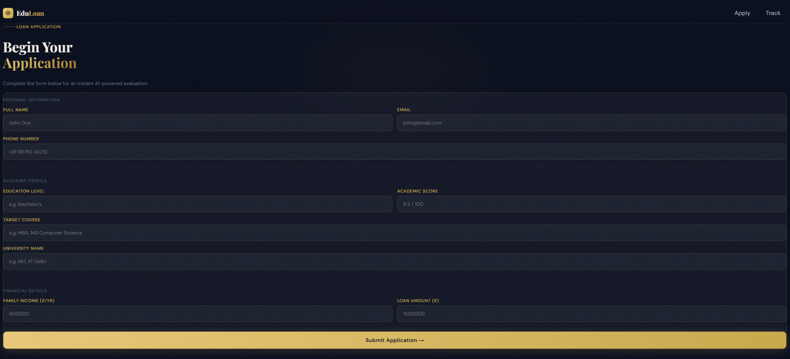
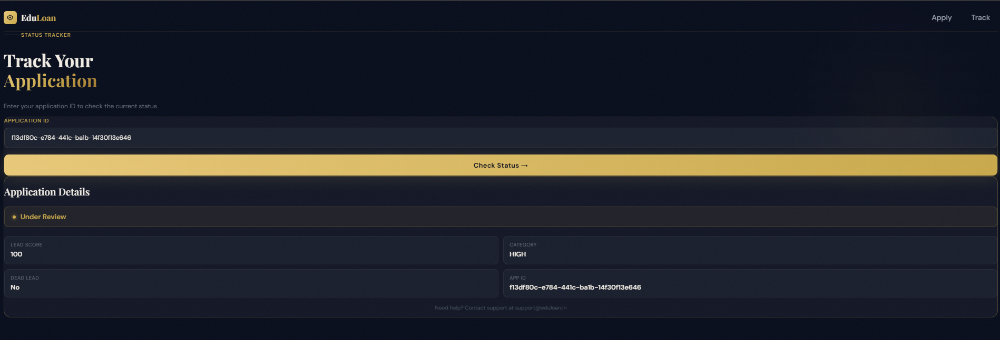

# EduLoan — Education Loan Application System

A full-stack education loan evaluation platform built with **Next.js**, **NestJS**, **PostgreSQL**, and **Prisma**. Designed with product thinking, scalable architecture, and explainable AI-style scoring logic to simulate how a real fintech company evaluates loan applications before manual review.

---

## Screenshots

### Landing Page


### Application Form


### Tracking Page


---

## Table of Contents

- [Overview](#overview)
- [Features](#features)
- [Tech Stack](#tech-stack)
- [System Architecture](#system-architecture)
- [Lead Scoring Logic](#lead-scoring-logic)
- [Dead Lead Detection](#dead-lead-detection)
- [API Endpoints](#api-endpoints)
- [Frontend Routes](#frontend-routes)
- [Getting Started](#getting-started)
- [Deployment](#deployment)
- [Future Improvements](#future-improvements)
- [Known Limitations](#known-limitations)

---

## Overview

Built as part of **Internship Selection Task – Round 1**, this project goes beyond a basic CRUD form. It simulates a real-world loan lead evaluation pipeline with:

- Smart lead scoring with explainable reasoning
- Rule-based fraud and dead lead detection
- Duplicate application prevention
- Real-time application status tracking

---

## Features

### Loan Application
Users fill out a form with personal, academic, and financial details and receive an instant evaluation result.

### Lead Scoring
Every application is automatically scored and categorised:

```json
{
  "leadScore": 82,
  "leadCategory": "HIGH",
  "scoringReasons": [
    "Strong academic performance",
    "High family income",
    "Top-ranked university"
  ]
}
```

### Dead Lead Detection
Suspicious or invalid applications are flagged before entering the pipeline:

```json
{
  "isDeadLead": true,
  "deadLeadReasons": [
    "Suspicious phone number",
    "Income-loan mismatch"
  ]
}
```

### Application Tracking
Users can look up any application by ID to view its current status, lead score, and category.

---

## Tech Stack

| Layer    | Technology                              |
|----------|-----------------------------------------|
| Frontend | Next.js, TypeScript, Tailwind CSS, React Hook Form, Axios |
| Backend  | Node.js, NestJS                         |
| ORM      | Prisma                                  |
| Database | PostgreSQL (Neon)                       |

---

## System Architecture

```
Frontend (Next.js)
        │
        ▼
REST API (NestJS)
        │
        ▼
Business Logic Layer
   ├── Scoring Engine
   ├── Dead Lead Detection
   └── Validation Layer
        │
        ▼
PostgreSQL Database
```

### Backend Folder Structure

```
src/
├── applications/
├── scoring/
├── dead-lead/
├── prisma/
└── main.ts
```

---

## Lead Scoring Logic

### Scoring Factors

| Factor               | Weight |
|----------------------|--------|
| Academic Performance | 25     |
| Family Income        | 25     |
| University Ranking   | 20     |
| Loan Burden          | 15     |
| Existing Debt        | 15     |

### Lead Categories

| Score Range | Category |
|-------------|----------|
| 75 and above | HIGH    |
| 45 – 74      | MEDIUM  |
| Below 45     | LOW     |

### Why These Fields Were Collected

| Field          | Reason                                      |
|----------------|---------------------------------------------|
| Academic Score | Measures educational merit                  |
| University Name | Indicates placement/employability potential |
| Family Income  | Determines repayment capability             |
| Loan Amount    | Used for risk analysis                      |
| Existing Loans | Evaluates debt burden                       |
| Education Level | Adds academic context                      |

---

## Dead Lead Detection

Rule-based checks that flag invalid or suspicious applications:

| Rule                  | Example                                         |
|-----------------------|-------------------------------------------------|
| Suspicious phone      | `9999999999`, `1234567890`                      |
| Suspicious email      | Addresses containing `test` or `fake`           |
| Financial mismatch    | Very low income + extremely high loan amount    |
| Duplicate application | Same email address used in a prior submission   |

---

## API Endpoints

| Method | Endpoint             | Description              |
|--------|----------------------|--------------------------|
| POST   | `/applications`      | Submit a new application |
| GET    | `/applications`      | List all applications    |
| GET    | `/applications/:id`  | Get application by ID    |

---

## Frontend Routes

| Route    | Purpose               |
|----------|-----------------------|
| `/`      | Landing page          |
| `/apply` | Loan application form |
| `/track` | Application tracking  |

---

## Getting Started

### Prerequisites

- Node.js 18+
- PostgreSQL database (or a [Neon](https://neon.tech) connection string)

### 1. Clone the Repository

```bash
git clone https://github.com/ishant212/Edu-Loan
cd Edu-Loan
```

### 2. Backend Setup

```bash
cd edu-loan-backend
npm install
```

Create a `.env` file:

```env
DATABASE_URL="your_postgresql_connection_string"
```

Run migrations and start the server:

```bash
npx prisma migrate dev
npm run start:dev
```

Backend runs at `http://localhost:3000`

### 3. Frontend Setup

```bash
cd edu-loan-frontend
npm install
npm run dev
```

Frontend runs at `http://localhost:3001`

---

## Deployment

| Layer    | Recommended Platform    |
|----------|-------------------------|
| Frontend | Vercel                  |
| Backend  | Render / Railway        |
| Database | Neon PostgreSQL         |

---

## Future Improvements

- Multi-step form wizard
- Admin dashboard with analytics
- AI-assisted risk scoring
- Email notifications and OTP verification
- Document upload support
- Credit score integration
- Async job processing

---

## Known Limitations

These were intentionally excluded to avoid over-engineering for the assignment scope:

- Rule-based scoring only (no ML model)
- No authentication system
- No document verification
- No real banking integrations
- No async job processing

---

## Conclusion

This project prioritises **product thinking**, **architecture quality**, and **explainable business logic** over a basic CRUD implementation. The goal was to simulate how a real education loan lead evaluation platform functions in production — with fraud prevention, scoring rationale, and a scalable modular backend.
